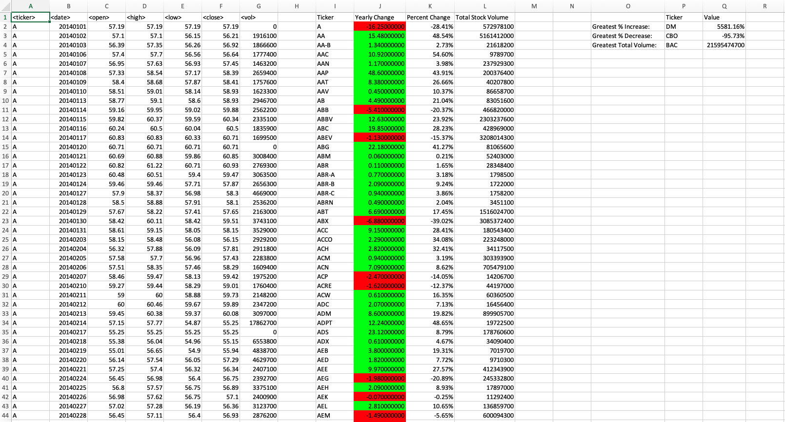
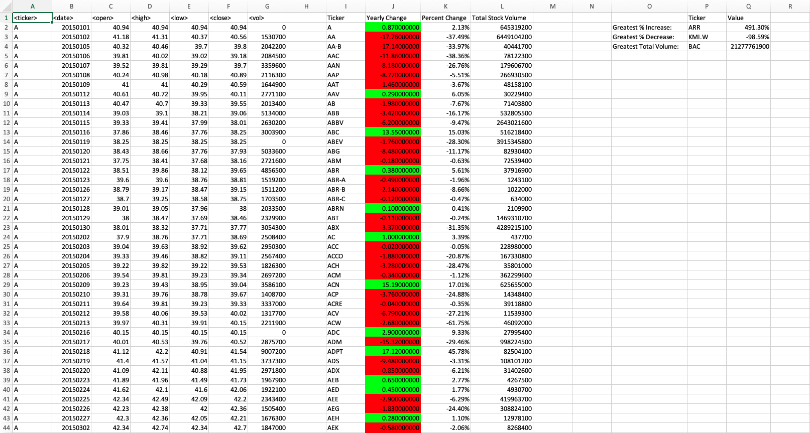
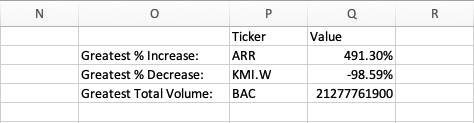
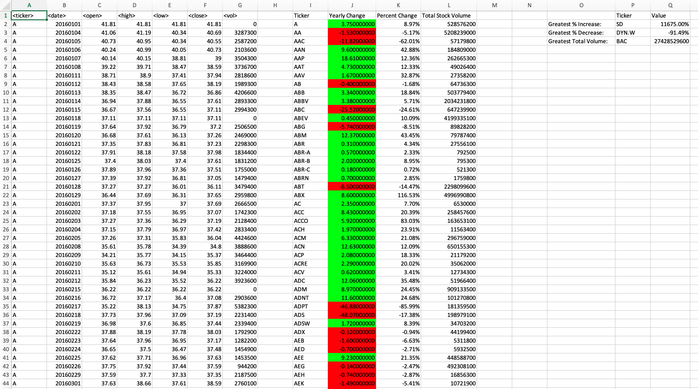
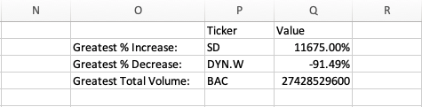

# Stock Market Data Analysis!

### Problem description
The purpose of this project is to analyze a dataset of Stock information that contains how every stock opened and closed, the highest and lowest price and the volume of every stock. This information is distributed by day (row by ticker by day).

The dataset provided contains three sheets which corresponds to a determined year: 2014, 2015 and 2016.

To analyze this information it is needed, for every stock, the following metrics:

- Yearly change from what the stock opened the year at to what the closing price was.
- The percent change from the what it opened the year at to what it closed.
- The total volume of the stock.

And also, to deicide which Stock is more reliable to invest in, I want to know the following Metrics by year:

- Greatest % increase.
- Greatest % decrease.
- Greatest total volume.

### Scripts

To solve this project I used Visual Basic for Applications inside Excel.

The problem was splited in three parts:

 1. To get the total amount of volume each stock had over the year. [Script 1](01_Easy_script.vb) 
 2. To get the Yearly Change and the Volume of the stock from what the stock opened the year at to what the closing price was. [Script 2](02_Moderate_script.vb)
 3. To locate the stock with the "Greatest % increase", "Greatest % Decrease" and "Greatest total volume". [Final Script](03_Hard_script.vb)

### Screenshots

The following screenshots show how the information is displayed after running the Final Script.

#### Sheet for 2014

 

 

#### Sheet for 2015

 

 

#### Sheet for 2016

 

 

